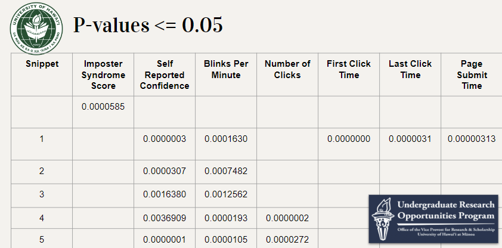
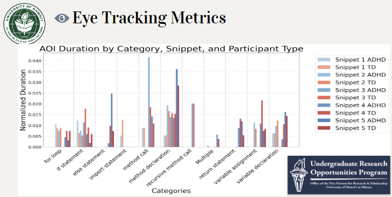
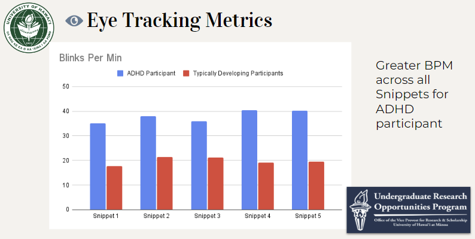
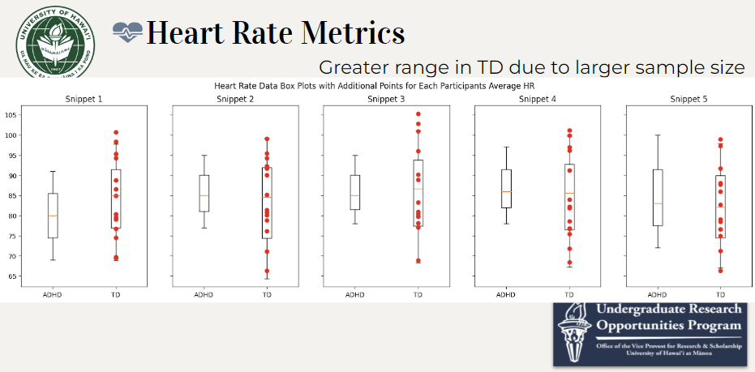
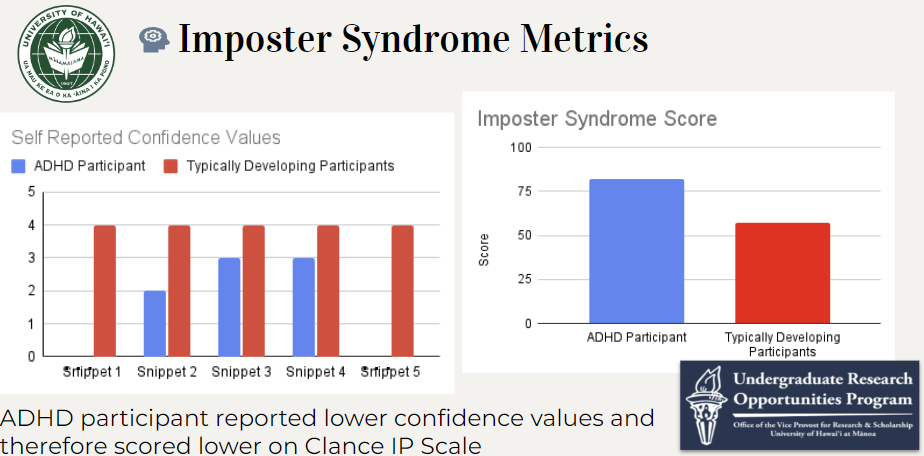
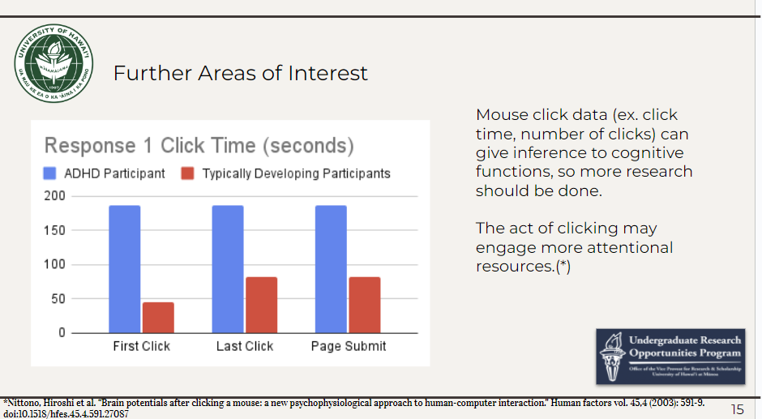

# Imposter Syndrome Pilot Analysis
***Exploring differences in physiological and behavioral measures between individuals with ADHD and Typically Developing during code comprehension.***

**Mentors:**
Dr. Katy Territ-Mirakhorli, Dr. Anthony Peruma, Aditi Jaiswal, and Zerin Nasrin Tumpa

**Researchers:** 
Kayla-Marie Torres

This analysis is performed as a part of a pilot study built upon work done by Alyssia Chen and Carol Wong at the University of Hawai'i at Manoa. Their paper and published materials can be found at [this link.](https://zenodo.org/records/10656487)

**Key Findings of Previous Study:** 
- Female students had higher characteristics of IP.
- Students with higher characteristics of IP were associated with spending longer on snippets and were less likely to answer the question related to each code snippet correctly. 
- Across all code snippets, those with higher characteristics of IP were more likely to look at the Method Call and Method Declaration code categories.

**Objective:**
We performed a data analysis to investigate if there are any potential differences between individuals with ADHD and Typically Developing (TD) during code comprehension.
We are hoping to do a pilot study in the fall on neurodiverse population (individuals with Autism, ADHD) and code comprehension.

**Abstract:** This study examines the physiological and behavioral differences between Computer Science (CS) students diagnosed with ADHD (Attention Deficit Hyperactivity Disorder) and Typically Developing (TD) during a code comprehension task. For this purpose, physiological and behavioral metrics such as eye movement, Area of Interests (AOI), heart rate, imposter syndrome and confidence questionnaires were measured. An independent sample t-test, specifically Welch’s t-test due to the assumption of unequal variances, was employed to compare the mean scores of the two groups — individuals with ADHD and TD. Preliminary findings suggest significant disparities in multiple physiological and behavioral metrics, including gaze patterns, heart rate variability, and self-reported imposter syndrome scores. These differences highlight the distinct ways in which individuals with ADHD engage with and respond to their environment during code comprehension compared to their TD counterparts. The results of this study could provide insights into tailored educational and professional strategies to accommodate the unique needs of individuals with ADHD in the field of software development and programming.

**Keywords:** ADHD, physiological metrics, behavioral metrics, eye tracking, heart rate, imposter syndrome, t-test, Welch’s test

## **Research Question**

How do physiological and behavioral metrics (such as eye tracking, heart rate, and imposter syndrome scores, etc.) differ between non-ADHD participants and an ADHD participant in a controlled environment?

# Analysis
A t-test is effective even with small sample sizes. Since I am comparing the means of two independent groups (non-ADHD participants vs. ADHD participant), I should use an independent t-test.

### Unequal vs. Equal Variance:

Equal variance or unequal variance between groups?

In this case I will assume unequal variance because of the difference in sample sizes (1 vs. multiple) which inherently suggests that the variances are unlikely to be equal. 

The assumption of equal variances (homoscedasticity) is generally more plausible when sample sizes are similar and drawn from the same population.

Assuming unequal variances is a more conservative approach, which will reduce the risk of false positives. 

For this case (different sample sizes) the Welch’s t-test (unequal variance independent t-test) is recommended.

## Encoding the data

Before we can merge the data to perform the t-Test, we must encode the data so that the categorical columns are numerical. Then I took the average of the numerical columns and the mode of the categorical columns to get a value for the typically developing students’ data to compare against the ADHD participant.

Click here to see encoded data

 
**How confident are you in your answer?**

| 0 | N/A (I answered 'I don't know' in the last question) |
| --- | --- |
| 1 | Not confident at all |
| 2 | Slightly confident |
| 3 | Somewhat confident |
| 4 | Fairly confident |
| 5 | Completely confident |

**True/False** 

| 0 | False |
| --- | --- |
| 1 | True |

**AOI**

| 0 | import statement |
| --- | --- |
| 1 | variable declaration |
| 2 | variable assignment |
| 3 | method declaration |
| 4 | if statement |
| 5 | else statement |
| 6 | for loop |
| 7 | method call |
| 8 | recursive method call |
| 9 | return statement |
| 10 | choice |

**Questionnaire (Q2-Q21)**

| 0 | not at all true |
| --- | --- |
| 1 | rarely |
| 2 | sometimes |
| 3 | often |
| 4 | very true |

**Q22**

| 0 | No |
| --- | --- |
| 1 | Yes |

## Limitations
Due to the disparity in sample sizes, the following results ***exhibit reduced statistical significance.*** Consequently, these findings should be interpreted with caution. For a more robust analysis in the pilot study, it is recommended to collect additional data to achieve balanced sample sizes.

# Results 
In the following areas we found the p-value to be less than 0.05

## Eye Tracking Metrics
### Areas of Interest (AOIs)
In some of the areas where the ADHD participant gazed longer than the TD participants, the difference is much longer. However, we can't generalize anything here, but we wanted to see if there was a difference in pattern to look into.

### Blinks per Minute (BPM)
The ADHD participant displayed greater blinks per minute throughout each code snippet. However, this was expected because it is researched that people with ADHD blink more than typically developing. 

## Heart Rate Metrics
TD participants have a greater range for min and max heart rate which is expected due to the difference in sample sizes. Not much of a difference in heart rate between groups.

## Imposter Syndrome Metrics
The adhd participant scored higher on the Clance Imposter phenomenon scale which was designed to help individuals determine whether or not they have IS and if so, to what extent they are suffering
because the TD participants had higher self reported confidence values, they have a lower IS score

## Further Areas of Interest
Click timing is an area I believe should be studied further. This was one of the most noteworthy findings from my analysis which I spent a lot of time on and strongly believe that it should be studied to the fullest extent in the pilot study. Mouse click data can give insight to cognitive functions, especially in CS and neurodiverse populations. This data was only recorded for snippet 1 due to it not being needed in the previous study. The ADHD participant waited longer to make each type of click: their first click, last click and submit page time

## Conclusion
Metrics such as eye tracking, heart rate, and IP scores were used as a foundation for research on potential differences between ADHD and TD during code comprehension.  

Further research is needed to establish a connection and this analysis serves as the preliminary investigation for a pilot study in the fall.

## Summary 
I gained a better understanding of this data and how to analyze it during this process.

A key finding was mouse click data (ex. click time, number of clicks) which can give inference to cognitive functions. The act of clicking may engage more attentional resources.  More research should be done in this area for the pilot study. 

A special thank you to Dr Katy for this opportunity this summer and thank you to Dr Peruma, Aditi Jaiswal, and Zerin Nasrin Tumpa for mentoring me along the way.

I enjoy and believe in this project. 

Thank you all for reading. 

